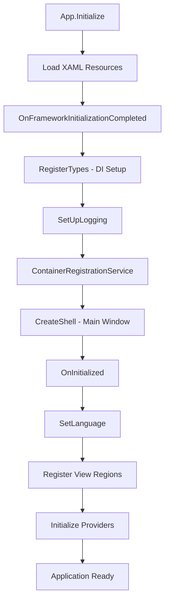

# Holos Application Architecture Guide

## Overview

Holos is a sophisticated desktop application built using modern .NET technologies and architectural patterns. This application is designed for agricultural carbon footprint calculation and farm management, utilizing a robust, modular architecture that promotes maintainability, testability, and scalability.

## Core Technologies & Patterns

### **Application Framework**
- **Avalonia UI**: Cross-platform .NET UI framework for desktop applications
- **.NET 9**: Latest .NET framework providing modern language features and performance improvements
- **C# 13.0**: Latest C# language version with enhanced features

### **Architectural Patterns**
- **MVVM (Model-View-ViewModel)**: Separates UI logic from business logic, enabling better testability and maintainability
- **Dependency Injection (DI)**: Promotes loose coupling and enables easy testing and component swapping
- **Prism Framework**: Provides modular application development with navigation, commands, and event aggregation

### **Dependency Injection Container**
- **DryIoc**: High-performance IoC container used as the underlying DI container
- **Prism.DryIoc**: Integration layer that combines Prism's application framework with DryIoc's container capabilities

## Application Bootstrap Process

Understanding the application's startup and initialization process is crucial for any developer working on this codebase. The entire application lifecycle begins with a single, critical class that acts as the **application bootloader**.

## Starting Point: App.axaml.cs - The Application Bootloader

**Location**: `H.GUI.Avalonia\H.Avalonia\App.axaml.cs`

The `App` class is the **entry point and orchestrator** of the entire application. It inherits from `PrismApplication` and is responsible for:

### **Why This Class Is Critical**

1. **Application Lifecycle Management**: Controls the entire application startup, initialization, and shutdown process
2. **Dependency Injection Setup**: Configures and registers all services, views, and components in the DI container
3. **Framework Integration**: Bridges Avalonia UI, Prism, and DryIoc frameworks
4. **Cross-Cutting Concerns**: Sets up logging, caching, language localization, and error handling

### **Key Responsibilities**

#### **Initialization Phase**
- Loads XAML resources and initializes the Avalonia framework
- Sets up the application lifetime management

#### **Dependency Registration**
- Configures comprehensive logging with NLog
- Registers hundreds of services, views, factories, and providers
- Sets up AutoMapper configurations for data transfer objects
- Configures caching and transfer services

#### **Application Shell Creation**
- Creates the main application window through dependency injection
- Ensures proper ViewModel location and binding

#### **Post-Initialization Configuration**
- Sets up language and culture settings
- Registers views with their designated UI regions
- Initializes geographic and data providers

#### **Application Lifecycle Events**
- Handles application shutdown with proper data persistence

### **Understanding the Flow**

### **Modern Architecture Benefits**

The architecture implemented in this bootloader provides:

- **Modularity**: Clean separation of concerns with dedicated registration services
- **Testability**: Comprehensive dependency injection enables easy unit testing
- **Observability**: Extensive logging throughout the initialization process
- **Maintainability**: Well-organized, documented code with clear responsibilities
- **Performance**: Optimized container configuration with efficient service resolution

### **Next Steps for Developers**

To fully understand this application:

1. **Start Here**: Study the `App.axaml.cs` class thoroughly - it's your roadmap to the entire application
2. **Follow the DI Trail**: Examine the `ContainerRegistrationService` to understand service registrations
3. **Understand the MVVM Structure**: Look at how views and view models are registered and resolved
4. **Explore Navigation**: Study how Prism regions and navigation work within the application

This bootloader class is not just initialization code - it's the **architectural blueprint** that defines how the entire application is structured, configured, and operated. Master this class, and you'll have a solid foundation for understanding the rest of the Holos application architecture.

---

## Document Structure

This guide will be expanded with additional sections covering:
- Detailed service architecture
- MVVM implementation patterns
- Data layer and storage systems
- UI composition and navigation
- Testing strategies
- Performance considerations

Each section builds upon the foundation established by understanding the application bootloader process.